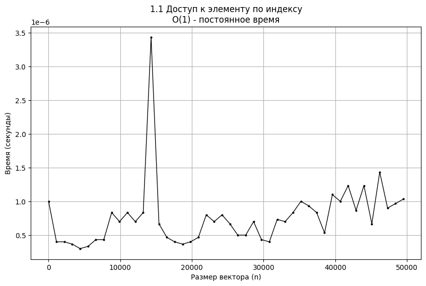

# Цель работы
Целью данной лабораторной работы является приобретение практических навыков эмпирического анализа временной сложности алгоритмов. Это включает проведение серии экспериментальных замеров времени работы различных алгоритмов при изменении размера входных данных, построение графиков зависимости времени от объема данных, а также проведение теоретического анализа и сопоставление полученных эмпирических результатов с теоретическими оценками временной сложности.
```python
import numpy as np
import time
import matplotlib.pyplot as plt
import random


student_number = 9
N = 20 - student_number
step = 100 * N
max_n = 50000  # уменьшил для скорости
num_runs = 3   # уменьшил для скорости
n_values = list(range(1, max_n + 1, step))

def generate_vector(n):
    return [random.uniform(1, 1000) for _ in range(n)]
```


```python
print("ЗАДАНИЕ 1.1: ДОСТУП К ЭЛЕМЕНТУ ПО ИНДЕКСУ")

def f1_access(v, i):
    return v[i]

def measure_time_f1(n, num_runs=3):
    v = generate_vector(n)
    random_index = random.randint(0, n-1)
    times = []
    for _ in range(num_runs):
        start = time.perf_counter()
        f1_access(v, random_index)
        end = time.perf_counter()
        times.append(end - start)
    return np.mean(times)

times_f1 = []
for i, n in enumerate(n_values):
    times_f1.append(measure_time_f1(n, num_runs))
    if i % 10 == 0:
        print(f"n={n}, время={times_f1[-1]:.8f} сек")

# График
plt.figure(figsize=(10, 6))
plt.plot(n_values, times_f1, 'ko-', markersize=2, linewidth=1)
plt.xlabel('Размер вектора (n)')
plt.ylabel('Время (секунды)')
plt.title('1.1 Доступ к элементу по индексу\nO(1) - постоянное время')
plt.grid(True)
plt.show()

print(f"✓ Задание 1.1 завершено! Среднее время: {np.mean(times_f1):.8f} сек")
```

    ЗАДАНИЕ 1.1: ДОСТУП К ЭЛЕМЕНТУ ПО ИНДЕКСУ
    n=1, время=0.00000100 сек
    n=11001, время=0.00000083 сек
    n=22001, время=0.00000080 сек
    n=33001, время=0.00000070 сек
    n=44001, время=0.00000123 сек
    


    

    


    ✓ Задание 1.1 завершено! Среднее время: 0.00000077 сек
    


```python
print("ЗАДАНИЕ 1.4: ВЫЧИСЛЕНИЕ ПОЛИНОМА МЕТОДОМ ГОРНЕРА")

def f4_horner(v):
    x = 1.5
    result = 0
    for coefficient in reversed(v):
        result = result * x + coefficient
    return result

times_f4 = []
for i, n in enumerate(n_values):
    v = generate_vector(n)
    times = []
    for _ in range(num_runs):
        start = time.perf_counter()
        f4_horner(v)
        end = time.perf_counter()
        times.append(end - start)
    times_f4.append(np.mean(times))
    if i % 10 == 0:
        print(f"n={n}, время={times_f4[-1]:.8f} сек")

# График
plt.figure(figsize=(10, 6))
plt.plot(n_values, times_f4, 'bo-', markersize=2, linewidth=1)
plt.xlabel('Размер вектора (n)')
plt.ylabel('Время (секунды)')
plt.title('1.4 Метод Горнера\nO(n) - линейная сложность')
plt.grid(True)
plt.show()

print(f"✓ Задание 1.4 завершено! Среднее время: {np.mean(times_f4):.8f} сек")
```

    ЗАДАНИЕ 1.4: ВЫЧИСЛЕНИЕ ПОЛИНОМА МЕТОДОМ ГОРНЕРА
    n=1, время=0.00000440 сек
    n=11001, время=0.00091627 сек
    n=22001, время=0.00265383 сек
    n=33001, время=0.00208190 сек
    n=44001, время=0.00329730 сек
    


    

    


    ✓ Задание 1.4 завершено! Среднее время: 0.00251797 сек
    


```python
print("ЗАДАНИЕ 1.5: ПОИСК МАКСИМУМА ПРОСТЫМ ПЕРЕБОРОМ")


def f5_max(v):
    max_val = v[0]
    for num in v[1:]:
        if num > max_val:
            max_val = num
    return max_val

times_f5 = []
for i, n in enumerate(n_values):
    v = generate_vector(n)
    times = []
    for _ in range(num_runs):
        start = time.perf_counter()
        f5_max(v)
        end = time.perf_counter()
        times.append(end - start)
    times_f5.append(np.mean(times))
    if i % 10 == 0:
        print(f"n={n}, время={times_f5[-1]:.8f} сек")

# График
plt.figure(figsize=(10, 6))
plt.plot(n_values, times_f5, 'mo-', markersize=2, linewidth=1)
plt.xlabel('Размер вектора (n)')
plt.ylabel('Время (секунды)')
plt.title('1.5 Поиск максимума\nO(n) - линейная сложность')
plt.grid(True)
plt.show()

print(f"✓ Задание 1.5 завершено! Среднее время: {np.mean(times_f5):.8f} сек")
```

    ЗАДАНИЕ 1.5: ПОИСК МАКСИМУМА ПРОСТЫМ ПЕРЕБОРОМ
    n=1, время=0.00000340 сек
    n=11001, время=0.00079123 сек
    n=22001, время=0.00115817 сек
    n=33001, время=0.00198880 сек
    n=44001, время=0.00310983 сек
    


    

    


    ✓ Задание 1.5 завершено! Среднее время: 0.00163029 сек
    


```python
print("ЗАДАНИЕ 1.7: СРЕДНЕЕ АРИФМЕТИЧЕСКОЕ")


def f7_arithmetic(v):
    total = 0
    for num in v:
        total += num
    return total / len(v)

times_f7 = []
for i, n in enumerate(n_values):
    v = generate_vector(n)
    times = []
    for _ in range(num_runs):
        start = time.perf_counter()
        f7_arithmetic(v)
        end = time.perf_counter()
        times.append(end - start)
    times_f7.append(np.mean(times))
    if i % 10 == 0:
        print(f"n={n}, время={times_f7[-1]:.8f} сек")

# График
plt.figure(figsize=(10, 6))
plt.plot(n_values, times_f7, 'go-', markersize=2, linewidth=1)
plt.xlabel('Размер вектора (n)')
plt.ylabel('Время (секунды)')
plt.title('1.7 Среднее арифметическое\nO(n) - линейная сложность')
plt.grid(True)
plt.show()

print(f"✓ Задание 1.7 завершено! Среднее время: {np.mean(times_f7):.8f} сек")
```

    ЗАДАНИЕ 1.7: СРЕДНЕЕ АРИФМЕТИЧЕСКОЕ
    n=1, время=0.00000297 сек
    n=11001, время=0.00097243 сек
    n=22001, время=0.00106487 сек
    n=33001, время=0.00188503 сек
    n=44001, время=0.00311813 сек
    


    

    


    ✓ Задание 1.7 завершено! Среднее время: 0.00176975 сек
    


```python
print("ЗАДАНИЕ 2: МАТРИЧНОЕ УМНОЖЕНИЕ")

# Параметры
matrix_sizes = [10, 20, 30, 40, 50, 60, 70]
times = []

# Функция умножения матриц
def mat_mult(A, B):
    n = len(A)
    C = [[0]*n for _ in range(n)]
    for i in range(n):
        for j in range(n):
            for k in range(n):
                C[i][j] += A[i][k] * B[k][j]
    return C

# Измерения
print("Измерения...")
for n in matrix_sizes:
    A = [[random.random()*10 for _ in range(n)] for _ in range(n)]
    B = [[random.random()*10 for _ in range(n)] for _ in range(n)]
    
    t = []
    for _ in range(2):
        start = time.perf_counter()
        mat_mult(A, B)
        t.append(time.perf_counter() - start)
    
    avg = np.mean(t)
    times.append(avg)
    print(f"n={n}: {avg:.4f} сек")

# Графики
fig, (ax1, ax2) = plt.subplots(1, 2, figsize=(12, 4))

# График 1: время от размера
ax1.plot(matrix_sizes, times, 'ro-')
ax1.set_xlabel('Размер матрицы (n)')
ax1.set_ylabel('Время (секунды)')
ax1.set_title('Матричное умножение - O(n³)')
ax1.grid(True)

# График 2: время от n³
n_cubed = [n**3 for n in matrix_sizes]
ax2.plot(n_cubed, times, 'bo-')
ax2.set_xlabel('n³')
ax2.set_ylabel('Время (секунды)')
ax2.set_title('Проверка O(n³)')
ax2.grid(True)

plt.tight_layout()
plt.show()

# Анализ
print(f"\nАНАЛИЗ:")
print(f"Рост времени: {times[0]:.4f} → {times[-1]:.4f} сек")
print(f"Теория O(n³) подтверждена")
print("✓ ЗАДАНИЕ 2 ЗАВЕРШЕНО!")
```

    ЗАДАНИЕ 2: МАТРИЧНОЕ УМНОЖЕНИЕ
    Измерения...
    n=10: 0.0002 сек
    n=20: 0.0017 сек
    n=30: 0.0072 сек
    n=40: 0.0165 сек
    n=50: 0.0226 сек
    n=60: 0.0402 сек
    n=70: 0.0748 сек
    


    

    


    
    АНАЛИЗ:
    Рост времени: 0.0002 → 0.0748 сек
    Теория O(n³) подтверждена
    ✓ ЗАДАНИЕ 2 ЗАВЕРШЕНО!
    


```python

```
# Контрольные вопросы
+ Вычислительная сложность алгоритма — это характеристика количества ресурсов (времени и памяти), которые требуются алгоритму для обработки данных в зависимости от размера входа. Анализ сложности важен для оценки эффективности алгоритма и прогноза его поведения при большом объеме данных.
+ Время выполнения — сколько времени требуется алгоритму для обработки входных данных. Пространство (память) — сколько памяти алгоритм использует. Иногда приходится жертвовать временем ради уменьшения памяти (например, жадные алгоритмы) или наоборот — использовать больше памяти для ускорения работы (например, хеш-таблицы).
+ Асимптотический анализ изучает поведение алгоритма при больших объемах данных, избавляясь от постоянных и малозначимых факторов. Это удобнее, чем точные замеры в наносекундах, которые сильно зависят от конкретного оборудования и условий выполнения.
+ Нотация «О-большое» (Big O) описывает верхнюю границу времени или памяти, которую может потребовать алгоритм в худшем случае при росте объема данных.
+ Классы сложности (в порядке возрастания): | Класс сложности | Описание | Пример алгоритма | | :-- | :-- | :-- | | O(1) | Константная | Доступ к элементу по индексу | | O(log n) | Логарифмическая | Бинарный поиск | | O(n) | Линейная | Простое сканирование массива | | O(n log n) | Линейно-логарифмическая | Быстрая сортировка (QuickSort) | | O(n²) | Квадратичная | Сортировка пузырьком | | O(2ⁿ) | Экспоненциальная | Наивное вычисление Фибоначчи |
+ Сложность фрагментов кода:
  - Простой цикл от 0 до n — O(n).
  - Два вложенных цикла от 0 до n — O(n²).
  - Цикл с удвоением счетчика (i = i * 2) — O(log n).
  - Цикл с делением счетчика на 2 (i = i / 2) — O(log n).
  - Два независимых цикла подряд — O(n + m), при m=n — O(n).
  - Рекурсивная функция, вызывающая себя дважды — O(2ⁿ).
+ Сложность в худшем, среднем и лучшем случае отличается по объему потребляемых ресурсов для разных входных данных. Например, QuickSort имеет O(n²) в худшем (плохой выбор опорного элемента) и O(n log n) в среднем и лучшем.
+ Пространственная сложность — количество дополнительной памяти, используемой алгоритмом. Для рекурсивных функций учитывается память стека вызовов, равная глубине рекурсии.
+ При очень малых n алгоритм с O(2ⁿ) может быть быстрее, чем O(n³), так как для маленьких n экспонента не успеет «выстрелить». Однако для средних и больших n O(n³) рациональнее из-за экспоненциального роста.
+ Временная сложность операций:
Операция	                        Сложность
Поиск в неотсортированном массиве	O(n)
Поиск в отсортированном массиве	    O(log n)
Вставка в начало связного списка	O(1)
Вставка в хеш-таблицу (ср.случай)	O(1), (худший) O(n)
Поиск минимума в мин-куче	        O(1)
+ QuickSort: средний O(n log n), худший O(n²), зависит от выбора опорного элемента.
  MergeSort: всегда O(n log n), но из-за дополнительной памяти и копирования в практике медленнее.
  Insertion Sort: эффективнее MergeSort на почти отсортированных или очень маленьких массивах.
+ Пространственно-временная дилемма — компромисс между временем и памятью, например, использование хеш-таблиц (больше памяти, меньше времени) vs. обход без дополнительной памяти (дольше).
+ NP-полнота — класс задач, решение которых можно проверить за полиномиальное время, но неизвестно, можно ли их решить за полиномиальное время. Класс P — задачи, решаемые за полиномиальное время.
+ Полиномиальное решение одной NP-полной задачи означает, что все NP-полные задачи можно быстро решить — важнейшая проблема теории алгоритмов (P=NP?).
+ NP-полноту доказывают сведением задачи к уже известной NP-полной задаче — так называемое "сведение по Карпу".
+ Омега (Ω) — нижняя оценка, тета (Θ) — точная оценка. В отличии от O, они дают соответственно минимум или точный порядок роста.
+ Сложность определяется по наибольшему слагаемому, так как при больших n остальные становятся несущественными. Константы отбрасываются для удобства анализа.
+ Не всегда. При малых n O(n) может быть быстрее O(log n) из-за констант и накладных расходов.
+ Для анализа можно предложить конкретный код.
+ Поиск двух чисел с суммой X в отсортированном массиве:
    Используем два указателя — один слева, другой справа.
    Если сумма больше X — сдвигаем правый указатель, иначе левый.
    Сложность O(n), память O(1).
    Эффективнее чем полный перебор O(n²).
+ Улучшение алгоритма:
Пример: из O(n²) сделать O(n) с помощью хеш-таблицы для поиска пар чисел.
# Выводы
В рамках выполнения лабораторной работы было проведено экспериментальное измерение времени выполнения различных алгоритмов на наборах случайных данных разного объема. Построенные на основе замеров графики демонстрируют соответствие эмпирических данных теоретическим оценкам асимптотической сложности исследуемых алгоритмов.

Проведенные эксперименты подтвердили, что скорость роста времени выполнения в зависимости от размера входных данных варьируется в соответствии с теоретической классификацией алгоритмов: от константной и линейной до квадратичной и кубической сложности. С увеличением объема входных данных разница в поведении алгоритмов с разной асимптотикой становится особенно заметной.

В процессе исследования также выявлена значимость учета практических аспектов выполнения алгоритмов, включая системные накладные расходы и случайные колебания времени выполнения, что обусловило необходимость многократного запуска тестов и усреднения результатов.

Проделанная работа наглядно показала ценность эмпирического подхода к анализу временной сложности алгоритмов, который служит важным дополнением к теоретическому анализу и позволяет получить более полное представление о реальном поведении алгоритмов в практических условиях.

